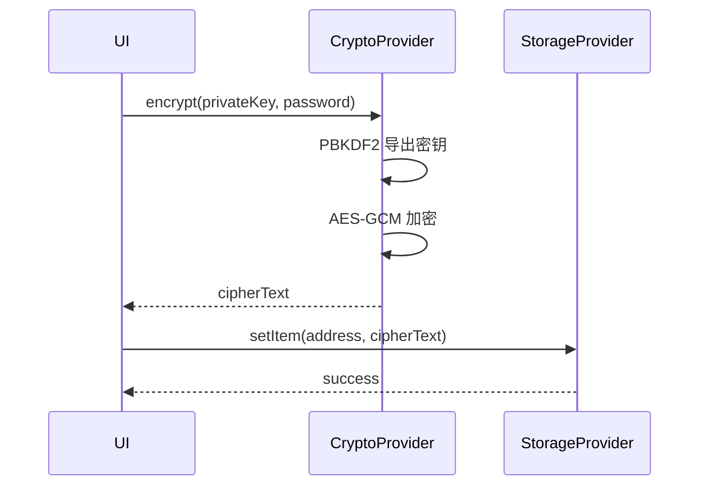
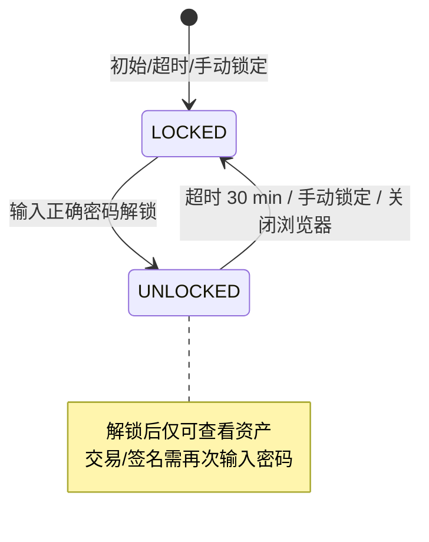
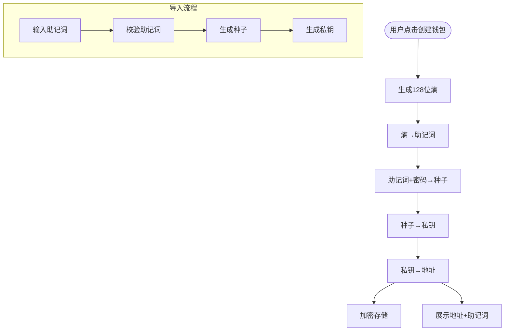
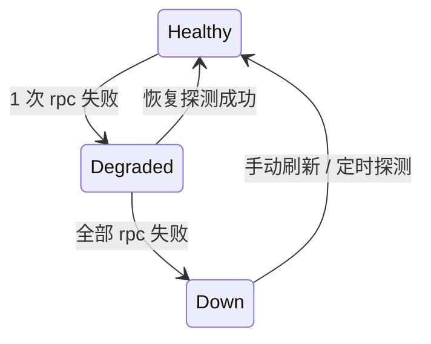
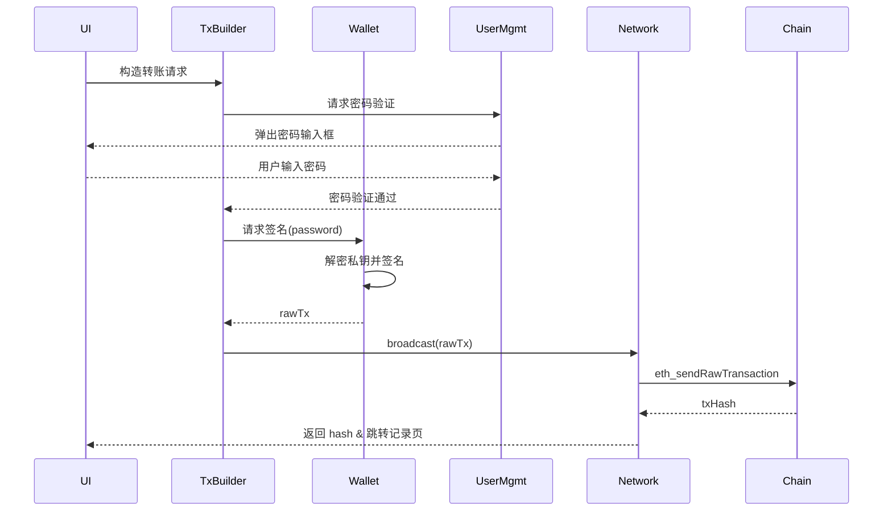
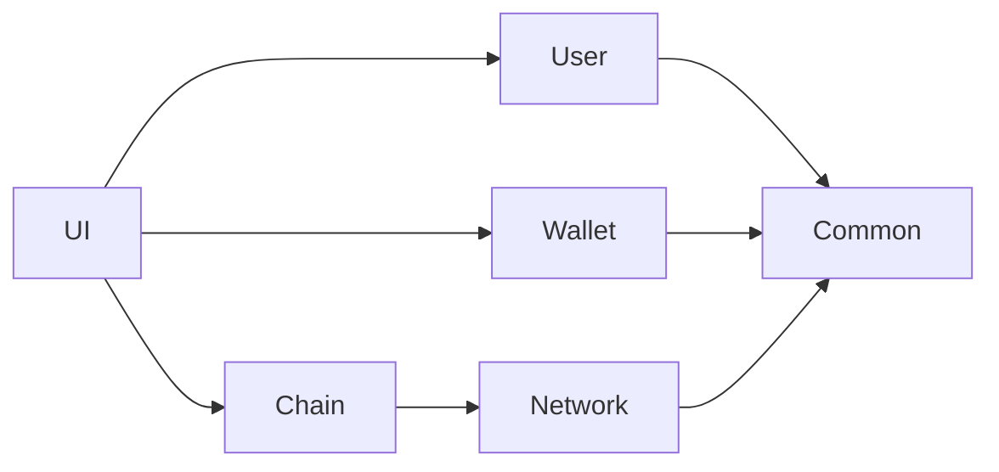
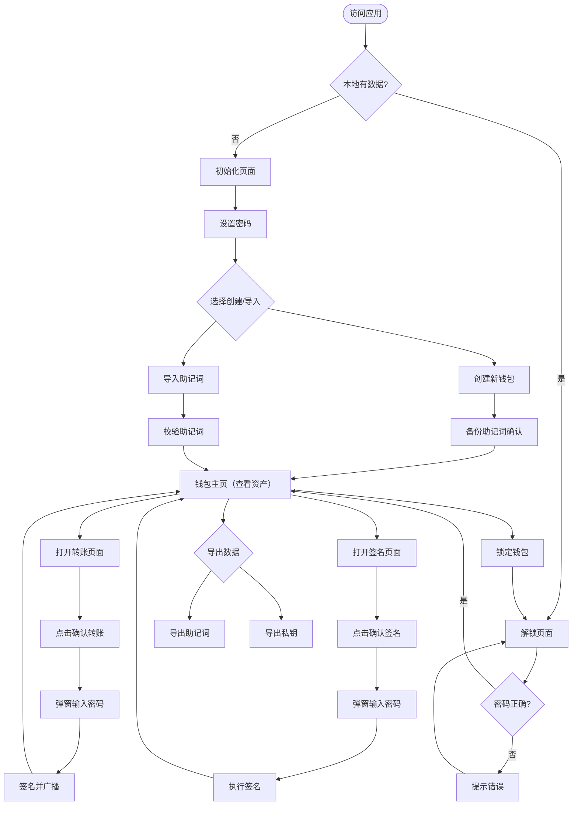

# 1 项目简介

- **项目名称**：0907 Wallet
    
- **系统类型**：基于浏览器的 Web3 去中心化钱包
    
- **系统定位**：轻量化、本地化、自托管的钱包系统
    
- **核心目标**
    
    - 提供安全可靠的钱包账户生成与管理能力
        
    - 支持基本的转账、消息签名与资产查看功能
        
    - 实现完整的本地化存储，全流程不上传私钥
        
- **非目标说明（可选）**
    
    - 不构建链下后端服务
        
    - 不提供中心化账户体系
        
    - 不托管任何用户资产

---

## 2 系统功能范围（Scope）

### 2.1 基础功能

- 用户密码创建与验证
    
- 助记词生成与展示
    
- 助记词导入
    
- 多账户管理（每个账户独立生成或导入，非派生）
    
- 链上资产（ETH）余额查询
    
- 交易发送（转账）
    
- 基本消息签名功能

### 2.2 扩展功能（可选）

- 多语言支持（中/英文）
    
- 钱包锁定 / 解锁
    
- 钱包数据导出（助记词 / 私钥）
    
- 友好的错误反馈与基础校验
    

---

## 3 系统整体结构（System Overview）

系统整体由以下四个主要模块组成：

### 3.0 系统公用模块

为上层模块提供横向能力，本身不依赖任何业务数据。

| 子模块 | 职责 | 关键技术 |
| --- | --- | --- |
| CryptoProvider | 封装浏览器 Crypto.subtle，提供统一同步/异步加解密接口 | AES-GCM、PBKDF2、SHA-256 |
| StorageProvider | 封装 IndexedDB & localStorage，提供带版本号的迁移能力 | Dexie.js |
| EventBus | 发布-订阅总线，用于模块间解耦事件（解锁、网络切换等） | 原生 CustomEvent |
| ErrorCode | 集中错误码与友好提示映射，支持 i18n | JSON 资源文件 |
| Logger | 分级日志（DEBUG/INFO/WARN/ERROR），生产环境自动关闭 | console.* 包装 |

### 3.1 用户管理模块

| 子模块 | 职责 | 流程 |
| --- | --- | --- |
| 密码管理 | 创建、校验、修改、强度提示 | 见下图 |
| 锁定状态机 | 维护 `LOCKED / UNLOCKED` 两态 | 超时自动切回 LOCKED |
| 交易密码验证 | 每次转账/签名前强制输入密码验证 | 不缓存密码，验证后立即用于解密 |
| 本地加解密 | 调用 CryptoProvider，提供 account 级密封/解封 | 统一盐值与 IV 规则 |

### 3.2 钱包管理模块

| 子模块 | 职责 | 关键技术 |
| --- | --- | --- |
| 助记词生命周期 | 生成、校验、备份提醒、清空 | BIP-39 |
| 私钥管理 | 助记词→种子→私钥，独立生成 | 每个账户独立私钥 |
| 账户对象池 | 内存缓存当前解锁的账户集合，支持重命名、删除 | Map<address, Account> |
| 交易/消息签名 | 构造交易/消息，**每次签名需传入密码** | ethers.js |

### 3.3 网络管理模块

负责“链”维度的一切静态配置与动态状态，对上层隐藏节点细节。

| 子模块 | 职责 | 流程 |
| --- | --- | --- |
| 链配置 | 维护 chainId、rpc 列表、浏览器地址、原生代币符号 | 资源文件 chain-config.json |
| 节点池 | 对同一链支持多 rpc 负载、失败切换、延迟探测 | 基于 axios-retry |
| 网络状态 | 实时区块高度、gas 价格、同步状态 | 轮询 + 指数退避 |

### 3.4 区块链交互模块

面向业务场景的最上层封装，只与 Network 模块打交道，不直接触碰 rpc。

| 子模块 | 职责 | 关键技术 |
| --- | --- | --- |
| 余额查询 | 单账户/批量查询 ETH 及 ERC-20 | ethers.Provider |
| 交易构造 | 自动填充 nonce、gas、chainId | ethers.PopulatedTransaction |
| 交易广播 | 发送 rawTx、返回 hash、缓存待确认记录 | 带重试的 ethers.sendTransaction |
| 事件监听 | 监听 pending->mined 状态变更、回滚检测 | WebSocket rpc → EventBus 推送 |

---

### 横向依赖关系

> 所有模块只能向下调用，禁止反向依赖；跨层通信统一通过 EventBus 以事件方式进行。

---

## 4 安全策略概述

### 4.1 数据处理原则

- 所有敏感数据仅存储在浏览器本地
    
- 系统不会上传、备份或托管任何私钥信息

### 4.2 密码策略

- 用户密码仅在本地生效
    
- 密码用于控制钱包解锁与私钥访问权限

### 4.3 交互安全性

- 引导用户及时备份助记词
    
- **每次转账、消息签名等敏感操作都必须重新输入密码确认**
    
- 密码输入采用独立模态框，防止UI钓鱼

---

## 5 前端界面与使用流程概述

### 5.1 页面结构

- 欢迎 / 初始页面
    
- 密码设置页面
    
- 创建钱包 / 导入钱包页面
    
- 钱包主页（账户与资产）
    
- 转账页面
    
- 设置页面

### 5.2 UI 使用流程

---

## 6 系统边界（System Boundaries）

### 6.1 系统内的内容

- 所有前端钱包业务逻辑
    
- 本地私钥生成与管理
    
- 与区块链节点的直接交互

### 6.2 系统外的内容

- 后端服务（链下后端）
    
- 数据库（链下存储）
    
- 外部钱包插件（MetaMask 等）
    
- 外部价格服务
    
- 区块链浏览器

---

## 7 非功能性要求（NFR）概述

### 7.1 安全性

- 私钥不会通过网络传输
    
- 用户密码需受到适当保护

### 7.2 可用性

- 页面结构简洁清晰
    
- 提供必要的错误提示

### 7.3 可维护性

- 核心钱包模块与 UI 分层
    
- 模块功能边界明确

### 7.4 扩展性

- 支持未来扩展多链能力
    
- 支持新增账户或资产类型

---

## 8 限制与已知问题（Known Limitations）

- 浏览器环境安全性依赖用户设备本身
    
- IndexedDB 数据可能因浏览器清理而丢失
    
- 私钥泄露后不可恢复

---

## 9 后续规划（Roadmap）

- **1.0**：单链钱包 + 基础转账/签名功能
    
- **2.0**：多链支持、NFT 基础展示
    
- **3.0**：DApp 连接（Inject Provider）
    
- **3.5**：移动端适配
    
- **4.0**：支持硬件钱包